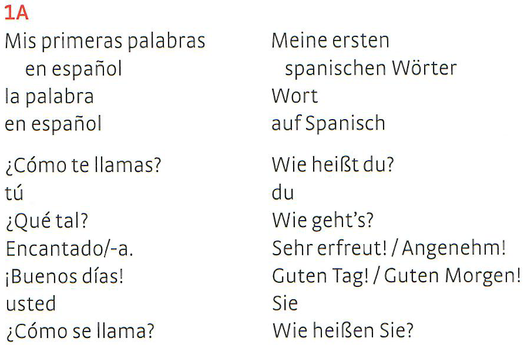

# vocab-ocr

Convert scans/images of vocabulary into csv (to use it in some vocabulary training app).

Everything is packaged in a [docker image](https://hub.docker.com/r/fabianthomas/vocab-ocr). Just deploy it on some server and use the web interface conveniently to process images from any device.

## Performance/Usability

The image quality that you provide is the most important thing. Use a scanner for best results and provide clean pages if possible. The images need to be unskewed and cutted to only the two columns that should be processed. Here are two examples:

### Spanish (processed in default mode):



**output:**
|<!---->              |<!---->                   |
|---------------------|--------------------------|
|1A                   |Meine ersten              |
|Mis primeras palabras|spanischen Wörter         |
|en español           |Wort                      |
|la palabra           |auf Spanisch              |
|en español           |Wie heißt du?             |
|¿Cómote llamas?      |du                        |
|tú                   |Wie geht’s?               |
|¿Qué tal?            |Sehrerfreut!/Angenehm!    |
|Encantado/-a.        |Guten Tag! / Guten Morgen!|
|¡Buenos días!        |sie                       |
|usted                |Wie heißen Sie?           |
|¿Cómo se llama?      |                          |

### Greenwich (processed in greenwich mode):


**output:**
|<!---->            |<!---->             |
|-------------------|--------------------|
|innovation         |Innovation; Neuerung|
|transportation (AE)|Transport           |
|innovative         |innovativ; kreativ  |
|‘mavativ           |nachdem             |
|after              |kolonisieren        |
|to colonize (AE)   |permanent; dauerhaft|

---

As you can see it works really well on the spanish example but not so well on the greenwich one. This comes from the annoying pronounciation hints at the end of the english vocabulary and the coloring. For that reason give good images to the process. Note that you will always need to open the csv file in some spreadsheet editor to fix stuff like the '1A' in the spanish example but for good scans it works really well.

## Installation/Setup

There are two ways to use this tool:
- [webinterface (recommended, docker image, server side)](#webinterface)
- [Command line (no docker image, client side)](#command-line)

### Webinterface

#### Setup

Install [docker](https://www.docker.com/) on your machine. Then do:
```bash
docker pull fabianthomas/vocab-ocr
docker run --restart=always -d fabianthomas/vocab-ocr
```
where `--restart=always` is optional. If you want the server running on some other port than 80 use `-p {YOUR_PORT}:80` on the run command.

##### Additional languages

By default English, French, German and Spanish are supported but it's really easy to add more:
- Add `tesseract-ocr-{YOUR_NEW_LANGUAGE_CODE}` at the end of the Dockerfile command in `Dockerfile` where tesseract languages are installed (note that you need to use [ISO 639-2/T language codes](https://en.wikipedia.org/wiki/List_of_ISO_639-1_codes)).
- Add `<option value="{YOUR_NEW_LANGUAGE_CODE}">{YOUR_NEW_LANGUAGE_NAME}</option>` in between the select tags of both left and right column language in `index.html`.
- Build the docker image and run it as before with your new image name. Refer to the [docker documentation](https://docs.docker.com/engine/reference/commandline/build/) on how to do that.

#### Usage

Navigate to `{YOUR_SERVERS_URL}:{YOUR_PORT}` where you insert either 80 or the port you specified before. Everything but the pre- and post processing modes should be straight forward. There is more information on that on the web interface.

### Command line

#### Dependencies:
- python3
    - opencv
    - pytesseract
- tesseract-ocr
    - tesseract-ocr-eng
    - ...

#### Usage:
Just use the `processing.py` python script. Take a look at the help page.

## How does it work?
- [tesseract-ocr](https://github.com/tesseract-ocr/tesseract) (Optical Character Recognition) for converting images into text.
- [open-cv](https://opencv.org/) for images processing.
- Regex substitutions for post processing the text.
